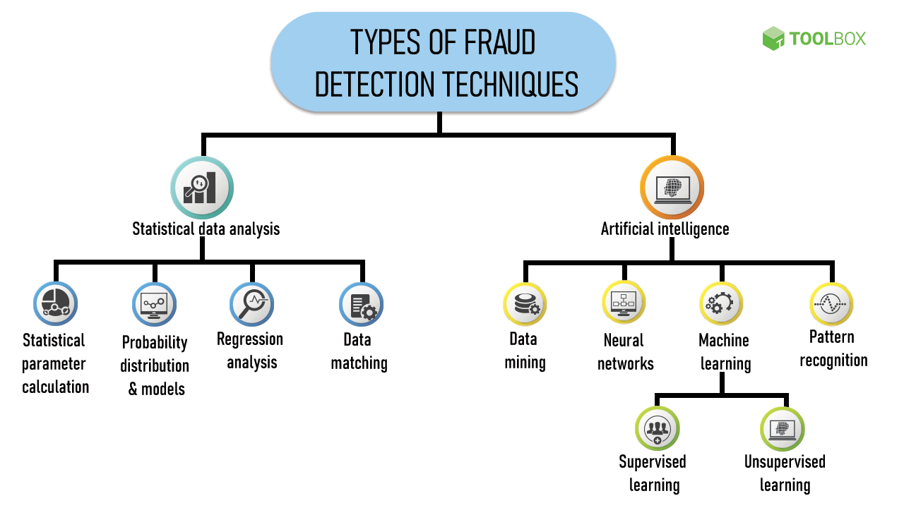

# DATA SCIENCE

## Machine Learning Project

### Fraud Detection

Fraud detection is defined as a process that detects scams and prevents fraudsters from obtaining money or property through false means. Fraud is a serious business risk that needs to be identified and mitigated in time.

#### Basic Steps involved in Fraud detection

1.  Create a potential fraud risk profile.
2.  Address the possible indicators of fraud.
3.  Implement continuous auditing and monitoring.
4.  Deploy Artificial Intelligence.
5.  Report fraud suspicious activity.

### Fraud detection Techniques

#### A well-designed and implemented fraud detection system can significantly reduce the chances of fraud occurring within an organization. In addition, timely detection of fraud directly impacts the business in a positive way by reducing future potential losses.

